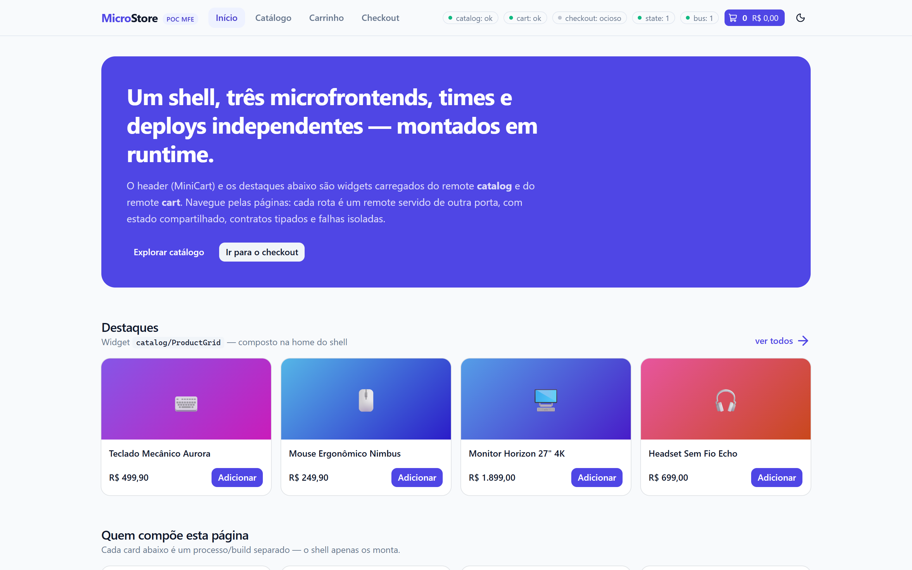
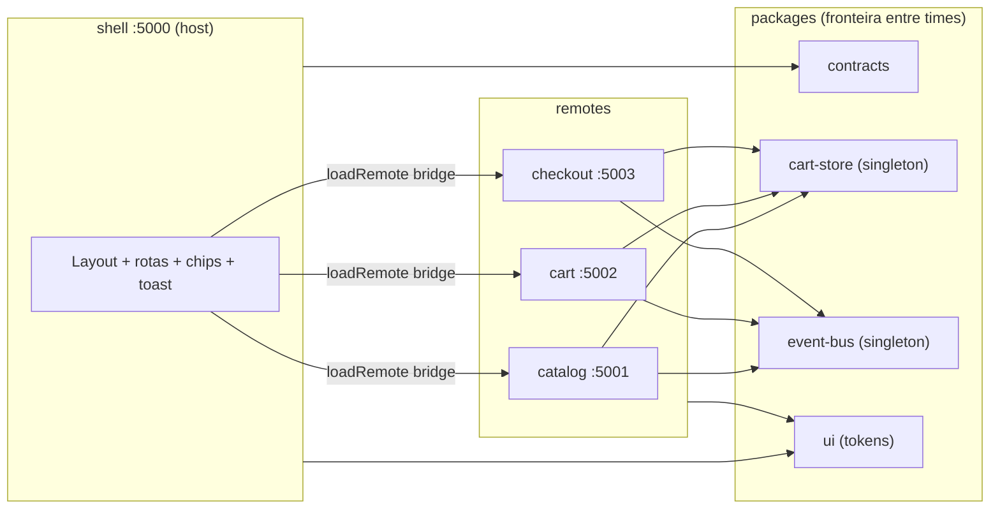

# MicroStore — POC de Microfrontends

E-commerce de demonstração (shell + 3 microfrontends) que prova, com código
real, como **Module Federation 2.0** resolve composição por rota, estado
compartilhado, dependências singletons e isolamento de falhas. Stack:
**Vite + React 19 + Tailwind 4 + TypeScript**, roteamento com React Router 7.



## Funcionalidades

- [x] Shell (host) monta **páginas inteiras** (bridge) e **widgets**
      (`cart/MiniCart`, `catalog/ProductGrid`) dos remotes
- [x] Navegação SPA entre MFEs sem reload (`MfeLink` + popstate sintético,
      `RouterSync`)
- [x] Store do carrinho **singleton** em todos os apps, persistida em
      `localStorage` e limitada ao estoque
- [x] Event bus tipado (`cart:item-added`, `order:placed`, `remote:status`…)
      com toasts no shell — sem importar código dos remotes
- [x] Resiliência: error boundary, card de fallback com porta + botão
      *Recarregar*, degradação do badge para a store local
- [x] `StatusChips` no header: status por remote (`ok`/`erro`) + contagem de
      instâncias da store e do bus (detecção de singleton quebrado)
- [x] Cada remote roda **standalone** (deploy independente)
- [x] Design tokens compartilhados (`@theme`), CSS compilado por app,
      dark mode
- [x] Qualidade: `typecheck`, `lint`, testes (21), smoke E2E (17 passos),
      verificação de produção e de resiliência

## Começando

**Requisitos:** Node `^20.19 || >=22.12` (testado em Node 24.11 + npm
11.6) e Microsoft Edge instalado (os scripts E2E usam `playwright-core`
com `channel: 'msedge'`).

```bash
npm install
npm run dev          # shell + catalog + cart + checkout
```

Abra <http://localhost:5000> — os remotes sobem nas portas 5001–5003.

### Scripts

| Comando | O que faz |
|---|---|
| `npm run dev` | 4 dev servers Vite (`concurrently`), 5000–5003 |
| `npm run build` | build de todos os workspaces (gera `dist/` de cada app) |
| `npm run preview` | serve os builds de produção (rode `build` antes) |
| `npm run typecheck` | `tsc --noEmit` em todos os workspaces |
| `npm run lint` | ESLint flat config único |
| `npm test` | Vitest (21 testes: store + event-bus) |
| `npm run smoke` | smoke E2E no build de dev (17 checks, Edge headless) |

Scripts de verificação (exigem os dev servers no ar):

| Comando | O que prova |
|---|---|
| `node scripts/verify-preview.mjs` | produção: CSS dos remotes no host, singletons (7/7) |
| `node scripts/verify-resilience.mjs` | cart fora do ar: shell + catálogo seguem (8/8) |
| `node scripts/take-screenshots.mjs` | gera as imagens de `docs/screenshots/` |

Variáveis opcionais (`apps/shell/.env.example`):
`VITE_CATALOG_ENTRY`, `VITE_CART_ENTRY`, `VITE_CHECKOUT_ENTRY` — permitem
apontar o shell para builds remotos sem recompilar.

## Arquitetura



**Três camadas de comunicação** (nenhum app importa código do outro):

1. `@microstore/contracts` — tipos + registry `REMOTES` (fonte única de
   nome/porta/rota);
2. `@microstore/cart-store` — estado síncrono, `shared` singleton via MF;
3. `@microstore/event-bus` — eventos tipados para efeitos transversais.

O bloco `shared` (react, router, store, bus) é declarado **uma única vez**
em `packages/build-config` e herdados pelos 4 `vite.config.ts` — anti-drift
de versões. Detalhes: [docs/01](docs/01-arquitetura.md),
[docs/03](docs/03-comunicacao-e-estado.md),
[docs/04](docs/04-shared-deps-e-singletons.md).

## Estrutura do projeto

```
poc-microfrontends/
├── apps/
│   ├── shell/        # host (:5000) — layout, rotas, chips, toast, remotes/
│   ├── catalog/      # remote (:5001) — listagem, detalhe, ProductGrid
│   ├── cart/         # remote (:5002) — CartPage, MiniCart
│   └── checkout/     # remote (:5003) — CheckoutPage
├── packages/
│   ├── contracts/    # tipos, eventos, registry REMOTES
│   ├── cart-store/   # store Zustand persistida (singleton via MF)
│   ├── event-bus/    # barramento tipado (singleton via MF)
│   ├── ui/           # theme.css (@theme), componentes compartilhados
│   └── build-config/ # bloco shared, alias, URLs de entry
├── docs/             # 8 guias (arquitetura → tradeoffs)
├── scripts/          # smoke, verify-preview, verify-resilience, screenshots
├── PLANO.md          # decisões técnicas, riscos e critérios de aceite
└── PRODUCT.md        # produto, personas e requisitos
```

## Testes

```bash
npm test                  # unit: store (clamp de estoque + persistência) e bus
npm run smoke             # E2E: fluxo completo home → catálogo → carrinho → checkout
```

O smoke cobre os 17 passos do happy path (inclusive remotes standalone e
404) e reporta `pageerrors`/`console.errors`/`requestfailed` no resumo.
Os avisos de console exclusivos de dev (React 19 × bridge-react/next-themes)
são filtrados por serem ausentes na build de produção — ver
[docs/06](docs/06-resiliencia-e-observabilidade.md).

## Documentação

| Doc | Responde |
|---|---|
| [01 — Arquitetura](docs/01-arquitetura.md) | como as peças se conectam |
| [02 — Composição e roteamento](docs/02-composicao-e-roteamento.md) | como um remote é montado e navega |
| [03 — Comunicação e estado](docs/03-comunicacao-e-estado.md) | como os apps conversam sem se importar |
| [04 — Shared deps e singletons](docs/04-shared-deps-e-singletons.md) | como evitar React duplicado |
| [05 — Estilos e design tokens](docs/05-estilos-e-design-tokens.md) | como o CSS se mantém isolado |
| [06 — Resiliência e observabilidade](docs/06-resiliencia-e-observabilidade.md) | o que acontece quando um remote cai |
| [07 — Deploy e versionamento](docs/07-deploy-e-versionamento.md) | como publicar um remote sozinho |
| [08 — Tradeoffs e alternativas](docs/08-tradeoffs-e-alternativas.md) | quando **não** usar microfrontends |

## Limitações conhecidas

- **POC sem backend**: pagamento/pedido são simulados; sem SSR, auth,
  CI/CD ou CDN real ([PLANO.md](PLANO.md) §1).
- O fallback de remote derrubado oferece **recarregar a página** — não há
  retry in-place (o `React.lazy` cacheia a falha).
- Em desenvolvimento, o React 19 emite 2 avisos de console
  (bridge-react × unmount; next-themes × script inline) que **não existem
  na build de produção** — [docs/06](docs/06-resiliencia-e-observabilidade.md).
- A navegação **interna** de um remote não repinta o `NavLink` ativo do
  shell até o próximo popstate (cosmético) — [docs/02](docs/02-composicao-e-roteamento.md).
