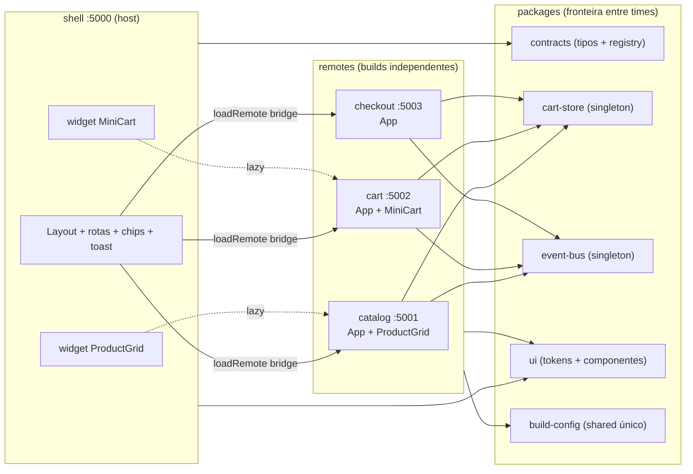

# 01 — Arquitetura

> Como as peças se conectam: um shell, três remotes e cinco packages que
> formam a fronteira entre times.

## Visão geral

O repositório é um monorepo (npm workspaces) com **1 shell (host)** e
**3 microfrontends (remotes)**, cada um com porta, build e ciclo de vida
próprios. Os remotes são compostos no shell em dois níveis: **páginas
inteiras** (via bridge do Module Federation) e **widgets** (componentes
soltos montados na árvore do shell).

## Portas e nomes

| App | Nome MF | Porta | Rota no shell | Exposes |
|---|---|---|---|---|
| `apps/shell` | `shell` | 5000 | `/` (dono das rotas) | — (host) |
| `apps/catalog` | `catalog` | 5001 | `/catalog/*` | `./App`, `./ProductGrid` |
| `apps/cart` | `cart` | 5002 | `/cart/*` | `./App`, `./MiniCart` |
| `apps/checkout` | `checkout` | 5003 | `/checkout/*` | `./App` |

Os nomes, portas, rotas e variáveis de ambiente de cada remote vivem em
**um único lugar**: `packages/contracts/src/remotes.ts` (`REMOTES`).
Shell, configs de build e documentação leem o mesmo registry. O mapa de
exposes (`REMOTE_EXPOSES`) documenta o contrato — os `exposes` em si
continuam declarados no `vite.config.ts` de cada remote.

## Packages

| Package | Papel | Compartilhado via MF? |
|---|---|---|
| `@microstore/contracts` | Tipos de domínio, mapa de eventos, registry de remotes | Não (valores puros e imutáveis — duplicar é inofensivo) |
| `@microstore/build-config` | Fonte única do bloco `shared` + URLs de entry | Não (só build time) |
| `@microstore/cart-store` | Store Zustand do carrinho | **Sim — singleton** |
| `@microstore/event-bus` | Barramento de eventos tipado | **Sim — singleton** |
| `@microstore/ui` | Design tokens (`@theme`), `Button`, `Card`, `Price`, `MfeLink` | Não (CSS compilado por app; duplicar é inofensivo) |

O raciocínio detalhado de o que compartilhar (e o que não compartilhar)
está em [04 — Shared deps e singletons](./04-shared-deps-e-singletons.md).

## Como o request flui

### Em desenvolvimento (`npm run dev`)

1. Quatro servidores Vite sobem em paralelo (5000–5003) via `concurrently`.
2. O shell renderiza o layout e, quando a rota pede um remote, o runtime do
   Module Federation busca o `remoteEntry.js` **na porta daquele remote**
   (ex.: `http://localhost:5001/remoteEntry.js`).
3. O remote dev server compila sob demanda — o shell **não** importa o
   código dos remotes; ele os consome em runtime, como se fossem APIs.
4. Dependências declaradas como `shared` (react, router, store, bus) são
   **negociadas uma única vez** no shell e reutilizadas pelos remotes.

### Em produção (`npm run build` + `npm run preview`)

1. Cada remote builda para o próprio `dist/` (container pré-compilado com
   `mf-manifest.json` — o shell não gera manifest, é o host).
2. O shell publica `VITE_*_ENTRY` apontando para as URLs públicas dos
   remotes (CDN) — **sem recompilar** o shell.
3. O fluxo de runtime é o mesmo do dev: o shell carrega os remotes sob
   demanda; a diferença é a origem das URLs.

Validado por `scripts/verify-preview.mjs` (7/7): CSS dos remotes
injetado, singleton funcionando e os três níveis montando em produção.

## Princípios que a estrutura impõe

- **Independência**: derrubar um remote nunca derruba o shell
  (verificado em `scripts/verify-resilience.mjs`, cenário: cart fora do ar).
- **Contrato antes de código**: apps conversam por tipos
  (`contracts`), estado síncrono (`cart-store`) e eventos (`event-bus`) —
  nunca importando um ao outro.
- **Uma fonte de verdade por assunto**: portas em `REMOTES`, `shared` em
  `createSharedConfig()`, tokens em `theme.css`.

Próximo: [02 — Composição e roteamento](./02-composicao-e-roteamento.md).
